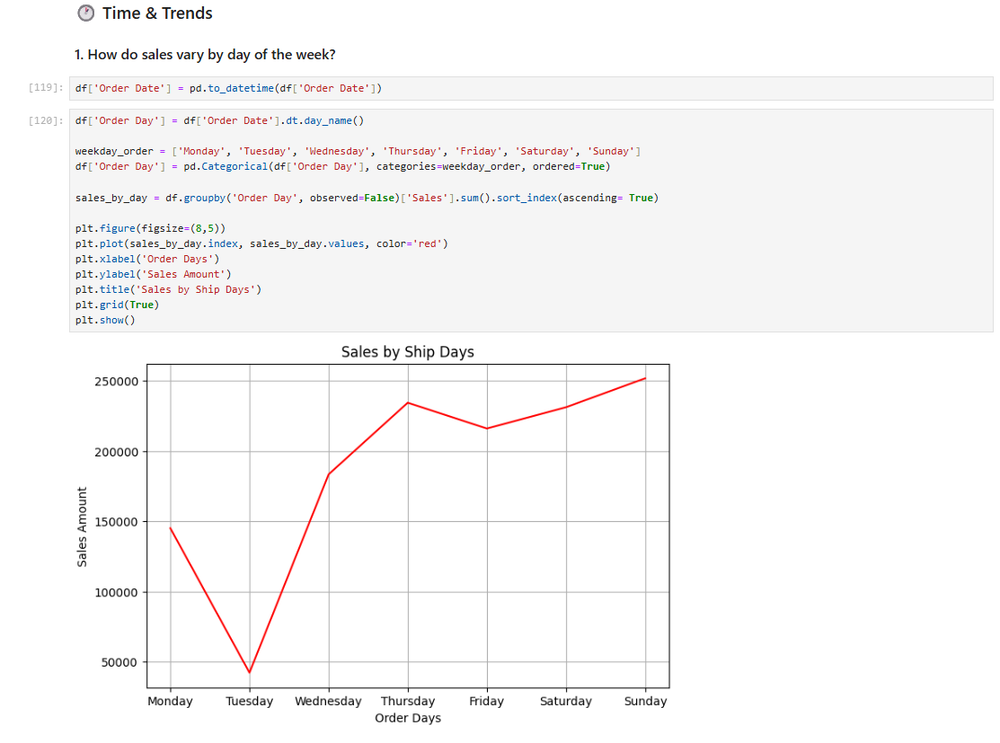

# Project Overview: Superstore Data Analysis

This project uses Python and Jupyter Notebook to explore analysis of Superstore’s sales data, with a focus on uncovering actionable insights across product performance, customer behavior, 
and regional trends. 

## Requirements
This notebook requires the following Python libraries:
- pandas
- numpy
- matplotlib
- seaborn
You can install them using pip
## Visualisation Preview

